# 考研数据分析可视化项目

## 一.项目介绍

### 1.1项目整体介绍

> ​	本项目用于对考研数据分析-学校-专业-分数线数据进行分析，统计考研学校和专业,通过多种指标,多种维度展示考研相关数据,帮助考研相关人员更清晰的了解考研相关数据和指标.

### 1.2项目需求分析

> ​	该项目以Hadoop和Mysql为数据存储中心，对考研数据进行一个分析使用。使用Hive数据仓库进行数据预处理工作使用Sqoop工具,使大数据集群Hive数据库和关系型数据库Mysql进行数据传输。并使用FineBI对接Mysql数据库进行可视化的展示；

+ 考研数据看板展示

  > 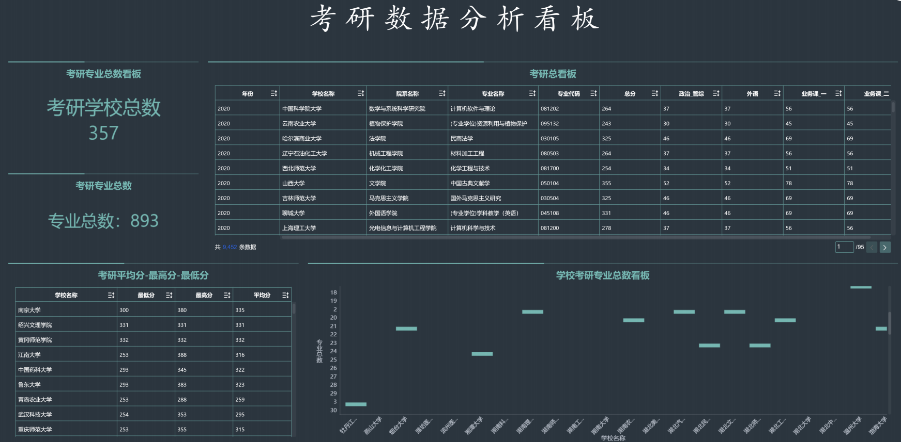

### 1.3项目框架和工具

> 数据存储: HDFS,Mysql
>
> 数据计算: SQL,Hive,Mysql
>
> 数据查询工具: DataGrip
>
> 数据传输工具: Sqoop
>
> 数据可视化: FineBI

#### 1.3.1系统数据流程设计展示

> 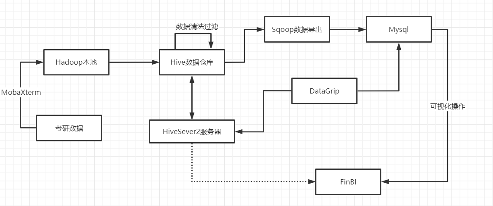

#### 1.3.2框架版本选型

| 框架     | 版本     |
| ------ | ------ |
| Hadoop | 3.1.3  |
| Hive   | 3.1.2  |
| Mysql  | 5.6.24 |
| Sqoop  | 1.4.6  |
| FinBI  | 5.1及以上 |


#### 1.3.3集群资源规划

| hadoop202   | hadoop203       | hadoop204   |
| ----------- | --------------- | ----------- |
| NameNode    |                 |             |
| DataNode    | DataNode        | DataNode    |
|             | ResourceManager |             |
| NodeManager | NodeManager     | NodeManager |

---

## 二.项目框架工具

### 2.1 Hadoop分布式存储计算系统

```
Hadoop是一个由Apache基金会所开发的分布式系统基础架构，主要就是解决数据存储和数据分析计算的问题（通过HDFS和MapReduce实现）。分布式就是多个服务器做同样的一件事。

Hadoop的三大发行版本：
    Apache版本: 最原始（基础）的版本，对于入门学习最好
    Cloudera在大型互联网企业中用得最多
    Hortonworks文档较好

Hadoop的优势：
    高可靠性：维护多个数据副本，在出现故障时会对失败的节点重新分布处理。
    高扩展性：在集群之间分配任务数据，可方便地扩展数以千计的节点。
    高效性：在MapReduce的思想下，Hadoop是并行工作的，以加快任务处理速度。
    高容错性：自动保存多份副本数据，并且能够自动将失败的任务重新分配。
    
Hadoop的组成：
    Hadoop HDFS:一个高可靠,高吞吐量的分布式文件系统（相当于磁盘）
    Hadoop MapReduce:一个分布式的离线并行计算框架。（形象理解就相当于跑的一个个应用程序，比如QQ）
    Hadoop Yarn：作业调度与集群资源管理的框架（相当于电脑系统）
    Hadoop Common:支持其他模块的工具模块,就是辅助前三个能正常运行的一些工具包。
```

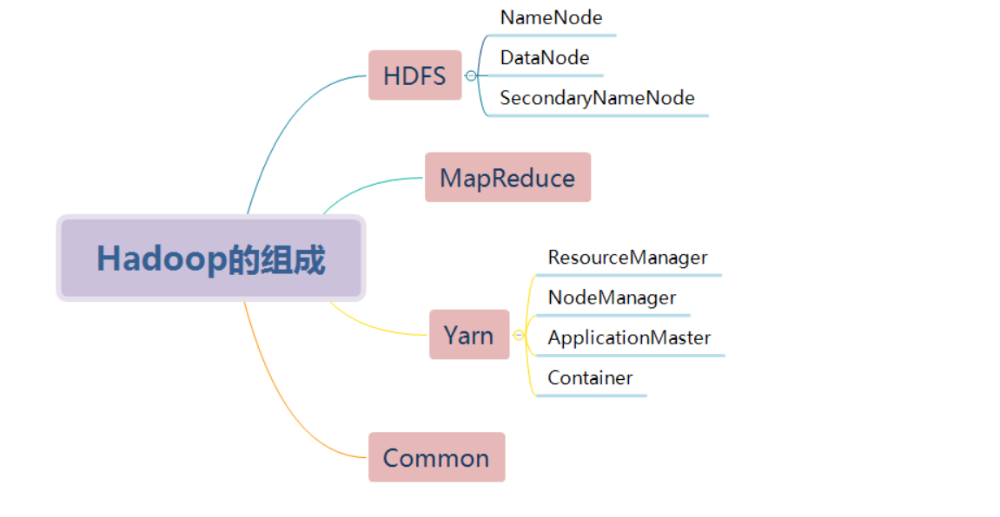

- - -

### 2.2 Hive数据仓库工具

```
Hive是基于Hadoop的一个数据仓库工具，可以将结构化的数据文件映射为一张数据库表，并提供类SQL查询功能。

直接使用hadoop所面临的问题
	人员学习成本太高
	项目周期要求太短
	MapReduce实现复杂查询逻辑开发难度太大

为什么要使用Hive
	操作接口采用类SQL语法，提供快速开发的能力。
	避免了去写MapReduce，减少开发人员的学习成本。
	扩展功能很方便。
	
Hive基本组成
	(1)用户接口：包括 CLI、JDBC/ODBC、WebGUI。
    (2)元数据存储：通常是存储在关系数据库如 mysql , derby中。
    (3)解释器、编译器、优化器、执行器。
    (4)用户接口主要由三个：CLI、JDBC/ODBC和WebGUI。其中，CLI为shell命令行；JDBC/ODBC是Hive的JAVA实现，与传统数据库JDBC类似；WebGUI是通过浏览器访问Hive。
    (5)元数据存储：Hive 将元数据存储在数据库中。Hive 中的元数据包括表的名字，表的列和分区及其属性，表的属性（是否为外部表等），表的数据所在目录等。
    (6)解释器、编译器、优化器完成 HQL 查询语句从词法分析、语法分析、编译、优化以及查询计划的生成。生成的查询计划存储在 HDFS 中，并在随后有 MapReduce 调用执行。

Hive与Hadoop的关系
	Hive利用HDFS存储数据，利用MapReduce查询数据
```

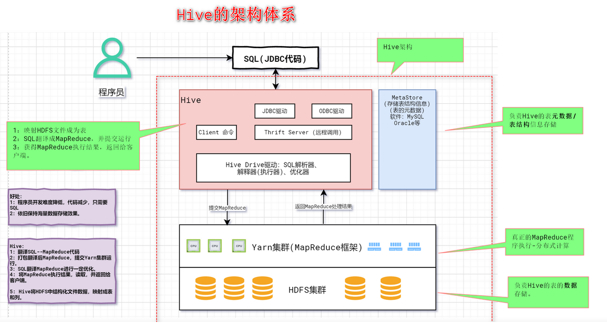

- - -

### 2.3 DataGrip数据查询

```
	DataGrip 版是由JetBrains公司推出的数据库管理软件，DataGrip支持几乎所有主流的关系数据库产品，如DB2、Derby、H2、MySQL、Oracle、PostgreSQL、SQL Server、Sqllite及Sybase等，并且提供了简单易用的界面，开发者上手几乎不会遇到任何困难。
```

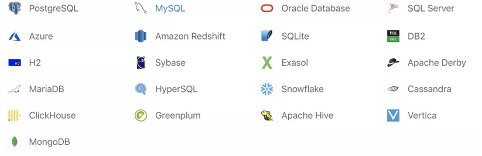

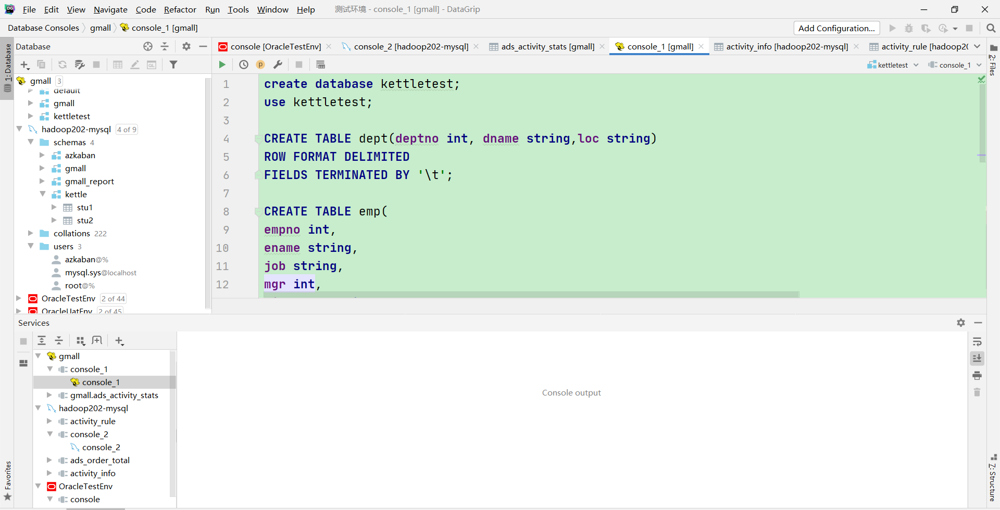

- - -

### 2.4 Mysql数据库系统

```
   MySQL是一款开源的关系型数据库管理系统，是目前世界上使用最为广泛的数据库之一。它支持多种操作系统，包括Linux、Windows、Unix等，同时还可以支持多种编程语言，如Java、C++、Python等。
MySQL的特点包括：
高性能：MySQL以其高速处理能力而闻名，可以处理大规模的数据请求。
可靠性：MySQL具有高度的稳定性和可靠性，保证数据的安全性和完整性。
灵活性：MySQL可以根据应用程序的需求进行设置和调整，以提高性能。
易用性：MySQL提供了丰富的命令和工具，使得用户可以方便地进行数据库管理和查询。
扩展性：MySQL支持多种存储引擎，可以根据应用程序的需要进行选择和设置。
MySQL的应用场景非常广泛，包括Web应用、企业应用、移动应用等等。它可以用于存储和管理各种类型的数据，如文本、图像、音频、视频等等。同时，由于MySQL具有开源的特点，因此它的使用成本相对较低，非常适合中小企业和开发者使用。
```


- - -
### 2.5 Sqoop数据传输工具

``` 
Sqoop是一款开源的工具，主要用于在Hadoop(Hive)与传统的数据库(mysql、postgresql...)间进行数据的传递，可以将一个关系型数据库（例如 ： MySQL ,Oracle ,Postgres等）中的数据导进到Hadoop的HDFS中，也可以将HDFS的数据导进到关系型数据库中。
Sqoop项目开始于2009年，最早是作为Hadoop的一个第三方模块存在，后来为了让使用者能够快速部署，也为了让开发人员能够更快速的迭代开发，Sqoop独立成为一个Apache项目。

Sqoop原理:将导入或导出命令翻译成mapreduce程序来实现。在翻译出的mapreduce中主要是对inputformat和outputformat进行定制。

Sqoop安装:安装Sqoop的前提是已经具备Java和Hadoop的环境。
```

- - -
### 2.6 FineBI可视化工具

```
FineBI 是帆软软件有限公司推出的一款商业智能（Business Intelligence）产品。FineBI 是定位于自助大数据分析的 BI 工具，能够帮助企业的业务人员和数据分析师，开展以问题导向的探索式分析。
```


```
FineBI的特点
	通过多人协作来实现最终的可视化构建
	不需要通过复杂代码来实现开发，通过可视化操作实现开发
	适合于各种数据可视化的应用场景
	支持各种常见的分析图表和各种数据源
	支持处理大数据
```


- - -
### 2.7 MobaXterm远程连接工具

```
MobaXterm 是一款功能强大的终端仿真软件，它可以在 Windows、Mac、Linux 等操作系统上模拟多个终端窗口。MobaXterm 不仅可以轻松地运行 Unix/Linux 上的 GNU Unix 命令，还可以显示远程 Unix 中的输出。除了基本的命令行工具外，MobaXterm 还提供了许多高级功能，如 SSH 转发、标签终端、加载项和插件等。MobaXterm 还可以通过插件扩展其功能，支持各种连接方式，如 SSH、X11、RDP、VNC、FTP、MOSH 等。
```

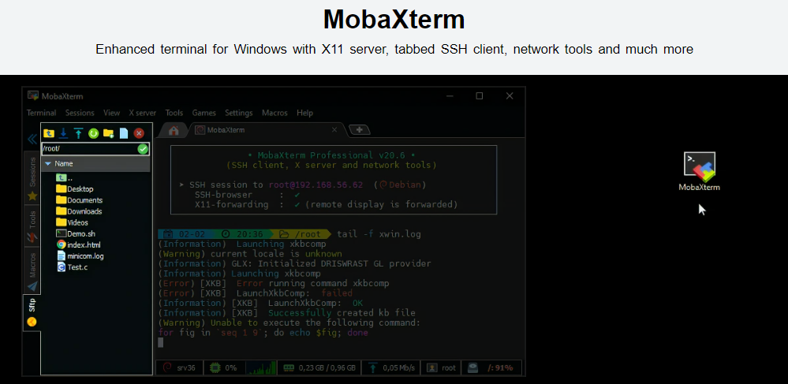


---

## 三.数据预处理项目搭建

### 3.1 数据来源
>   通过考研官方网站,[百度百科](https://baike.baidu.com/)以及和[鲸社区公开数据集](https://www.heywhale.com/mw/dataset/5fe1706383e4460030ab004f)等相关网站整理获取

### 3.2 需求描述
>获取到的考研数据文件不够理想,有多余的行和列,以及无效的、重复的数据,需要进行相对应的数据清洗和过滤操作.

###  3.3数据处理
>1. 将windows本地txt文件通过Mobaxterm上传到Linux本地
>2. 将Linux本地数据通过命令行语句加载到Hive数据库中
>3. 在Hive数据库中对原数据表进行数据清洗(清洗掉不需要的列和数据)

#### 1) win本地文件上传至Linux本地

> + 通过MobaxTerm工具将数据上传到Linux本地 ' /opt/module/hive/datas/ '路径中
>
>   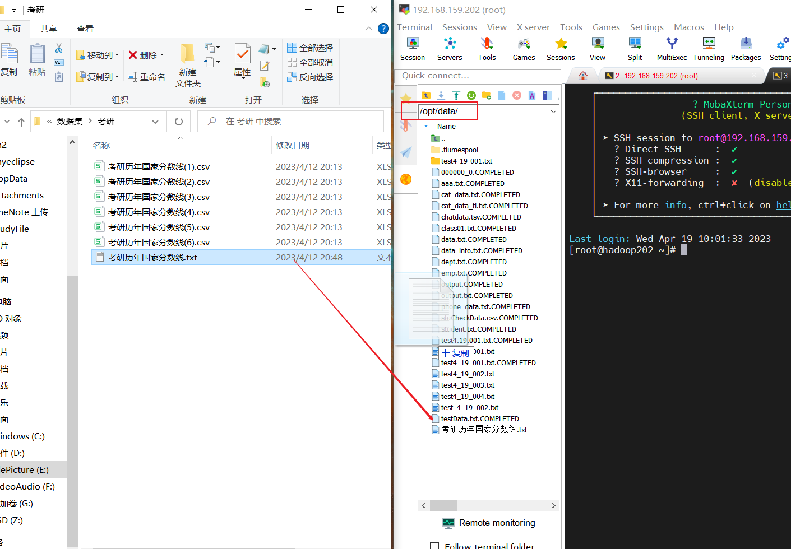

#### 2）将数据加载至Hive数据表中

##### 1.创建考研数据数据库

> ```mysql
> create database kaoyan_analyse;
> ```

#####  2.在数据库中创建考研数据分析表
>
> ```Mysql
>create external table if not exists ky_stu_analy(
> year string comment "年份"
> , school_name_link string comment "学校名称_链接"
> ,school_name string comment "学校名称"
> ,depname_link string comment "院系名称_链接"
> ,depname string comment "院系名称"
> ,spec_code string comment "专业代码"
> ,spec_code_link string comment "专业名称_链接"
> ,spec_name string comment "专业名称"
> ,total string comment "总分"
> ,poli string comment "政治_管综"
> ,fore_lang string comment "外语"
> ,busi_one string comment "业务课_一"
> ,busi_two string comment "业务课_二"
> )
> row format delimited fields terminated by '\t';
> ```
>
> > + 考研数据表数据分析
> >
> >   ```
> >   -- 考研数据分析
> >
> >   --考研数据字段。
> >   -- 年份
> >   -- 学校名称_链接
> >   -- 学校名称
> >   -- 院系名称_链接
> >   -- 院系名称
> >   -- 专业代码
> >   -- 专业名称_链接
> >   -- 专业名称
> >   -- 总分
> >   -- 政治_管综
> >   -- 外语
> >   -- 业务课_一
> >   -- 业务课_二
> >   ```
> >


##### 3.将数据导入到Hive数据库中ky_stu_analy数据表中
> + 方式1: 从Linux本地导入数据到ky_stu_analy数据表中
>
>   ```Mysql
>   load data local inpath '/opt/module/hive/datas/student.txt' overwrite into table ky_stu_analy;
>   ```
>
> + 方式2: 从HDFS导入数据到ky_stu_analy数据表中
>
>   ``` mysql
>   load data inpath '/input/ky_analy/考研历年国家分数线.txt' overwrite into table ky_stu_analy;
>   ```
>
>   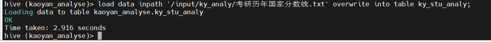

##### 4.查询数据确认数据导入成功

```mysql
use kaoyan_analyse;
```
```mysql
select * from ky_stu_analy;
```

> + 查询导入数据后发现数据带有*号跟丢失的数据和学校重复的专业以及对应的网址
>
> 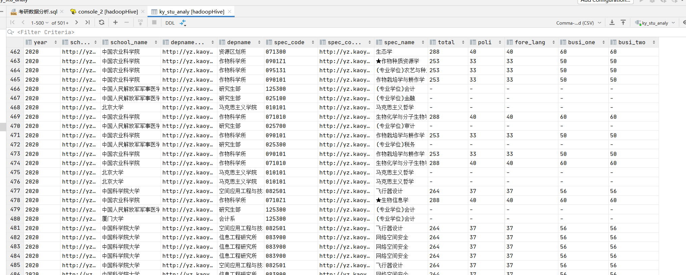

#### 3) 数据清洗

##### 1. 查询并过滤带链接的字段以及过滤掉数据丢失的字段  (查询结果导入)

> + 查询结果展示

```mysql
insert overwrite table ky_stu_analy_etl
select
 year,school_name,depname,spec_code,spec_name,total,poli,fore_lang,busi_one,busi_two
from 
 ky_stu_analy 
where
 busi_one not in ("-") or busi_two not in ("-");
 
 --清洗两遍
insert overwrite table ky_stu_analy_etl
select * from ky_stu_analy_etll where busi_one not in ("-");
--最后一遍
insert overwrite table ky_stu_analy_etl
select * from ky_stu_analy_etll where busi_two not in ("-");
--查询有没有丢失的数据busi_one-and-busi_two两个字段
select * from ky_stu_analy_etll where busi_one in ("-");
```

> 丢失数据成功过滤 ↓

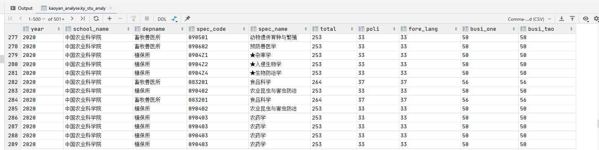

+ 根据专业代码进行分组过滤重复的数值  ---有重复专业

> + 建立etl数据表
>
>   ```mysql
>   create external table if not exists ky_stu_analy_etl(
>   year string comment "年份"
>   ,school_name string comment "学校名称"
>   ,depname string comment "院系名称"
>   ,spec_code string comment "专业代码"
>   ,spec_name string comment "专业名称"
>   ,total string comment "总分"
>   ,poli string comment "政治_管综"
>   ,fore_lang string comment "外语"
>   ,busi_one string comment "业务课_一"
>   ,busi_two string comment "业务课_二"
>   )
>   row format delimited fields terminated by '\t';
>   ```
>
> + 建立清洗辅助表
>
>   ```mysql
>   create external table if not exists ky_stu_analy_etlll(
>   cnt1 string comment "统计"
>   ,year string comment "年份"
>   ,school_name string comment "学校名称"
>   ,depname string comment "院系名称"
>   ,spec_code string comment "专业代码"
>   ,spec_name string comment "专业名称"
>   ,total string comment "总分"
>   ,poli string comment "政治_管综"
>   ,fore_lang string comment "外语"
>   ,busi_one string comment "业务课_一"
>   ,busi_two string comment "业务课_二"
>   )
>   row format delimited fields terminated by '\t';
>   ```
>
> + 导入语句(查询结果导入)
>
>   ```mysql
>   insert overwrite table ky_stu_analy_etlll
>   select 
>    count(distinct spec_code) t,year, school_name, depname, spec_code, spec_name,total,poli,fore_lang, busi_one,busi_two
>   from
>    ky_stu_analy_etl 
>   group by 
>    year, school_name, depname, spec_code, spec_name,total,poli,fore_lang, busi_one,busi_two 
>   having 
>    count(1)>1;
>   ```
>
> + 将数据导入回elt表中:
>
>   ```mysql
>   insert overwrite table ky_stu_analy_etl
>   SELECT 
>   	year, school_name, depname, spec_code, spec_name, total, poli, fore_lang, busi_one, busi_two
>   FROM 
>   	ky_stu_analy_etlll;
>   ```
>
>   > - <u>查询后可以发现学校没有重复的专业了</u>
>   >
>   > 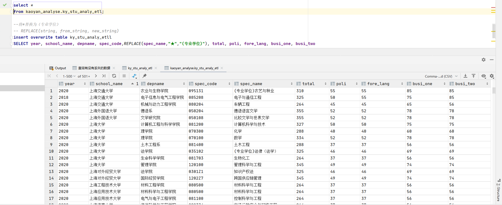

##### 2.查询过滤无意义数据

###### ①.将**★**替换为(专业学位)

>```mysql
>insert overwrite table ky_stu_analy_etll
>SELECT 
>	year, school_name, depname, spec_code,REPLACE(spec_name,"★","(专业学位)"), total, poli, fore_lang, busi_one, busi_two
>FROM 
>	ky_stu_analy_etl;
>```
>
>- 通过DataGrip查询后发现已完成替换操作
>
>  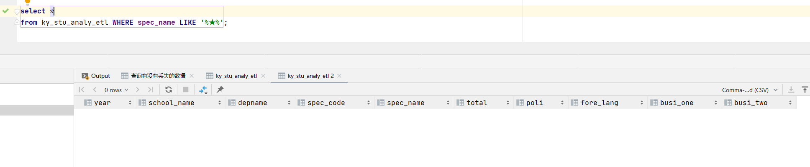

###### ②.过滤字段长度为0的数据(空值,无意义)

>- 通过DataGrip查询,发现有空值字段
>
>  ```mysql
>  select *
>  from ky_stu_analy_etl where length(school_name)=0;
>  ```
>
>  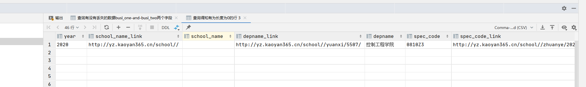
>- 过滤长度为0的字段
>  ```mysql
>  insert overwrite table ky_stu_analy_etl
>  select *
>  from ky_stu_analy_etll where length(school_name)!=0;
>  ```
>
>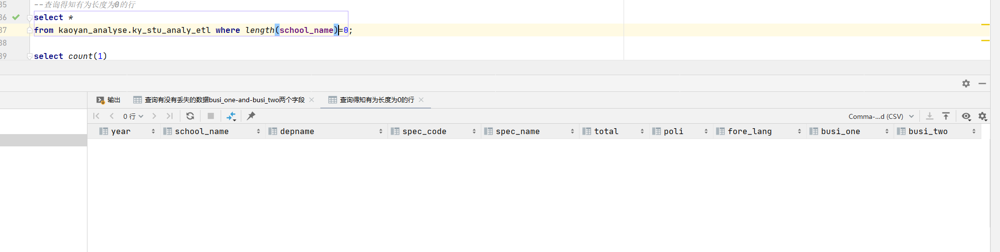

---

## 四. 数据指标

---
## 数据表结构分析
>```mysql
> year string comment "年份"
>,school_name string comment "学校名称"
>,depname string comment "院系名称"
>,spec_code string comment "专业代码"
>,spec_name string comment "专业名称"
>,total string comment "总分"
>,poli string comment "政治_管综"
>,fore_lang string comment "外语"
>,busi_one string comment "业务课_一"
>,busi_two string comment "业务课_二"
>```
---
### 4.1 需求1 统计考研专业数最多的学校
#### 1.需求分析
>通过sql语句，查询不同学校开设考研专业的数量，对查询结果进行排序,并将结果导入至新建数据表中

#### 2.编写SQL
> + 创建数据表
>
> ```mysql
> create external table if not exists ky_analy_major_ct1(
> year string comment "年份"
> ,school_name string comment "学校名称"
> ,spec_code string comment "专业总数"
>
> )
> row format delimited fields terminated by '\t';
>
> ```
>
> + 查询导入数据
>
> ```mysql
> insert overwrite table ky_analy_major_ct1
> select  year,school_name ,count(spec_code) spec_cont
> from kaoyan_analyse.ky_stu_analy_etl
> group by school_name,year 
> order by spec_cont desc;
> ```
>
> + DataGrip查询数据表数据
>
> ```mysql
> select *
> from ky_analy_major_ct1;
> ```
>
> 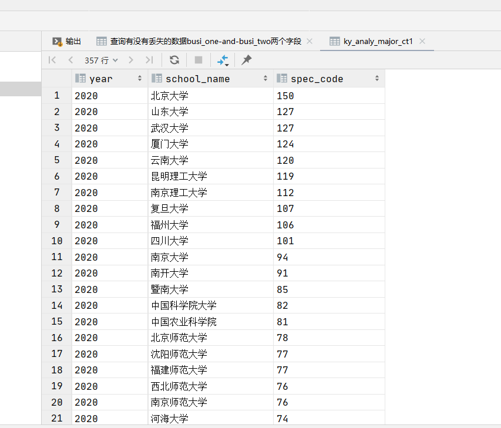


### 4.2 需求2 统计各年份学校专业的总数,以及展示学校不同的专业

#### 1.需求分析

> 通过sql语句，查询统计各年份学校专业的总数,以及展示学校不同的专业，并将结果导入至新建数据表中

#### 2. 编写SQL

> + 创建数据表
>
> ```mysql
> create external table if not exists ky_analy_major(
> year string comment "年份"
> ,school_name string comment "学校名称"
> ,spec_code string comment "专业名称"
> ,spec_cot string comment "专业总数"
> )
> row format delimited fields terminated by '\t';
> ```
>
> + sql查询结果导入数据
>
> ```mysql
> insert overwrite table ky_analy_major
> select year,school_name ,spec_name,count(spec_code) over(partition by school_name) num1
> from kaoyan_analyse.ky_stu_analy_etl order by num1 desc;
> ```
>
> + DataGrip查询结果表数据
>
> ```mysql
> select *
> from ky_analy_major;
> ```
>
> 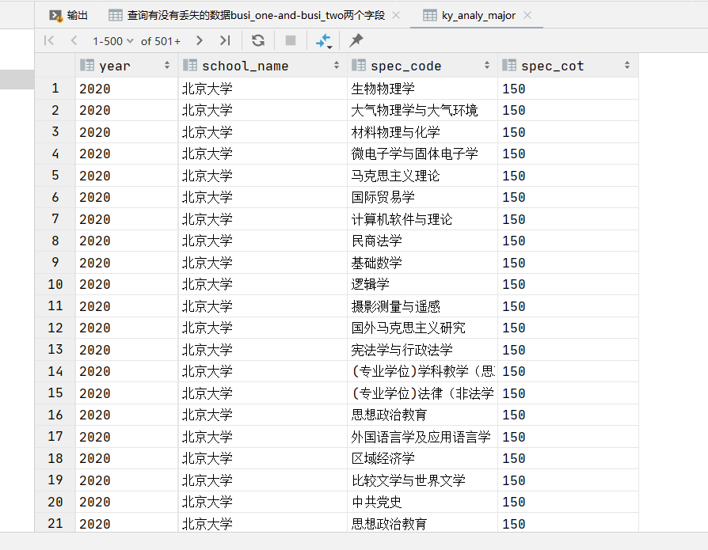

### 4.3 需求3 统计各年份考研专业开设数量最多的 top50
#### 1.需求分析
>通过sql语句，查询统计不同学校的考研专业数量开设最多的前50，需要去重统计,并将结果导入至新建数据表中

#### 2.编写SQL
> + 创建数据表
>
> ```mysql
> create external table if not exists ky_analy_major_top50(
> year string comment "年份"
> ,school_name string comment "专业名称"
> ,spec_cot50 string comment "专业数量"
> )
> row format delimited fields terminated by '\t';
> ```
>
> + 查询结果数据导入
>
> ```mysql
> insert overwrite table ky_analy_major_top50
> select year,spec_name,count(spec_code) spec_cont50
> from ky_stu_analy_etl 
> group by spec_name,year 
> order by spec_cont50 desc limit 50;
> ```
>
> + DataGrip查询数据结果
>
> ```mysql
> select *
> from ky_analy_major_top50;
> ```
>
> 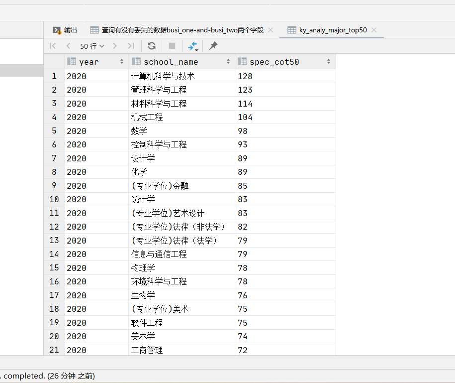


### 4.4 需求4  查询统计考研学校最高投档分数,最低投档分数以及平均分
#### 1.需求分析
>通过sql语句，分别查询各考研学校的最高投档分，最低投档分以及对应的平均分，并将结果导入至新建数据表中

#### 2.编写SQL
> + 创建数据表
>
> ```mysql
> create external table if not exists ky_analy_major_mig(
> school_name string comment "学校名称"
> ,depname string comment "最高分"
> ,spec_code string comment "最低分"
> ,spec_name string comment "平均分"
> )
> row format delimited fields terminated by '\t';
> ```
>
> + 查询结果数据导入
>
> ```mysql
> insert overwrite table ky_analy_major_mig
> select school_name,max(total) max,min(total) min,ceil(avg(total)) avg
> from ky_stu_analy_etl 
> group by school_name;
> ```
>
> + DataGrip查询结果数据
>
> ```mysql
> select *
> from ky_analy_major_mig;
> ```
>
> 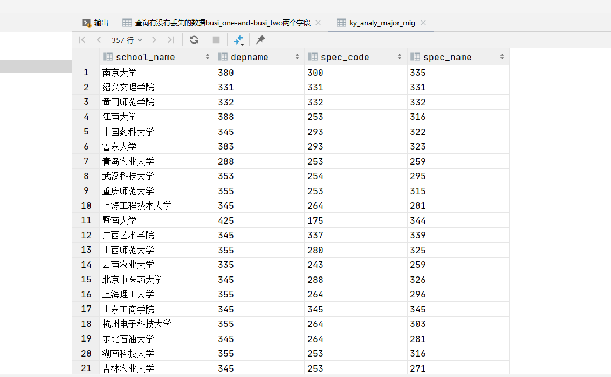

### 4.5 需求5 查询统计没有专业学位的学校
#### 1.需求分析
>通过sql语句，查询所有不含专业学位专业的学校及其对应的信息，并将结果导入至新建数据表中

#### 2.编写SQL
> + 创建数据表
>
> ```mysql
> create external table if not exists ky_analy_major_notspec(
> year string comment "年份"
> ,school_name string comment "学校名称"
> ,depname string comment "院系名称"
> ,spec_code string comment "专业代码"
> ,spec_name string comment "专业名称"
> ,total string comment "总分"
> ,poli string comment "政治_管综"
> ,fore_lang string comment "外语"
> ,busi_one string comment "业务课_一"
> ,busi_two string comment "业务课_二"
> )
> row format delimited fields terminated by '\t';
> ```
>
> + 查询结果数据导入
>
> ```mysql
> insert overwrite table ky_analy_major_notspec
> select *
> from ky_stu_analy_etl 
> WHERE spec_name not LIKE '%专业学位%';
> ```
>
> + DataGrip查询结果数据
>
> ```mysql
> select *
> from ky_analy_major_notspec;
> ```
>
> 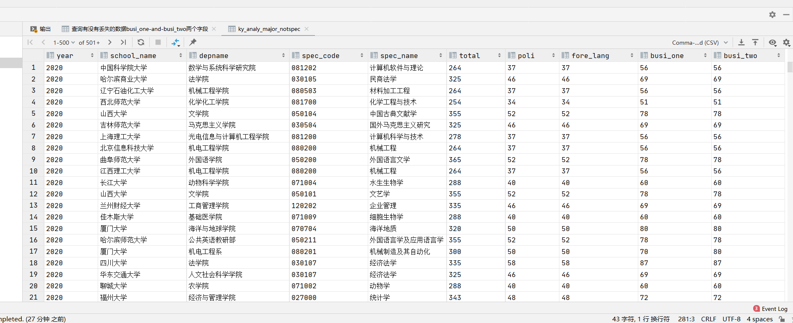

### 4.6 需求6 查询统计拥有专业学位的学校
#### 1.需求分析
>查询统计所有开设（专业学位）专业的学校，并将查询结果导入到新建的统计数据表中

#### 2.编写SQL
> + 创建数据表
>
> ```mysql
> create external table if not exists ky_analy_major_spec(
> year string comment "年份"
> ,school_name string comment "学校名称"
> ,depname string comment "院系名称"
> ,spec_code string comment "专业代码"
> ,spec_name string comment "专业名称"
> ,total string comment "总分"
> ,poli string comment "政治_管综"
> ,fore_lang string comment "外语"
> ,busi_one string comment "业务课_一"
> ,busi_two string comment "业务课_二"
> )
> row format delimited fields terminated by '\t';
> ```
>
> + 查询结果数据导入
>
> ```mysql
> insert overwrite table ky_analy_major_spec
> select *
> from ky_stu_analy_etl WHERE spec_name LIKE '%专业学位%' ;
> ```
>
> + DataGrip查询结果数据
>
> ```mysql
> select *
> from ky_analy_major_spec;
> ```
>
> 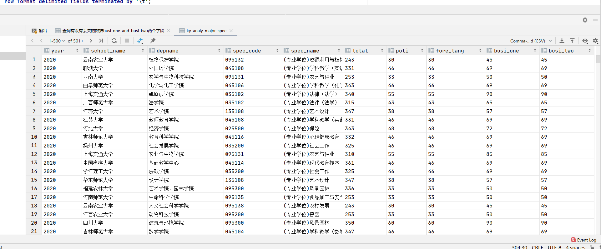


### 4.7 需求7 含有专业学位的学校top10
#### 1.需求分析
>查询统计含有专业学位数量的前10个学校排名.

#### 2.编写SQL
> + 创建数据表
>
> ```mysql
> create external table if not exists ky_analy_major10(
> school_name string comment "学校名称"
> ,spec_num string comment "专业学位"
> )
> row format delimited fields terminated by '\t';
> ```
>
> + 查询结果数据导入
>
> ```mysql
> insert overwrite table ky_analy_major10
> select school_name ,count(spec_name) l 
> from (
>     select *
>     from ky_stu_analy_etl 
>     WHERE spec_name LIKE '%专业学位%'
> ) t  
> group by school_name 
> order by l desc limit 10;
> ```
>
> + DataGrip查询结果数据
>
> ```mysql
> select *
> from ky_analy_major10;
> ```
>
> 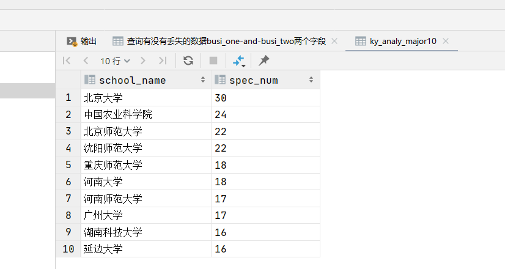

### 4.8 需求8 统计专业总数
#### 1.需求分析
>查询统计考研可选专业的总数，需要进行去重查询

#### 2.编写SQL
> + 创建数据表
>
> ```mysql
> create external table if not exists ky_analy_major_spec_cunt(
>     cntspec string comment "专业总数"
>     )
>     row format delimited fields terminated by '\t';
> ```
>
> + 查询结果数据导入
>
> ```mysql
> insert overwrite table ky_analy_major_spec_cunt
> select count(1) 
> from(
>     select spec_name, count(spec_name) t
>     from kaoyan_analyse.ky_stu_analy_etl 
>     group by spec_name 
>     order by t desc) f;
> ```
>
> + DataGrip查询结果数据
>
> ```mysql
> select *
> from ky_analy_major_spec_cunt;
> ```
>
> 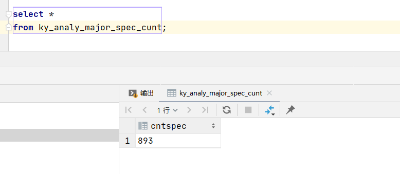
---

## 五.Sqoop数据传输

### 5.1需求描述
> 由于用于连接Hive数据仓库的__HiveSever2服务器__***不稳定***,所以需要将Hive数据库中的数据表通过__Sqoop数据传输工具__将__数据导出__到__Mysql关系型数据库__中,方便后续FineBI数据可视化工具的连接.

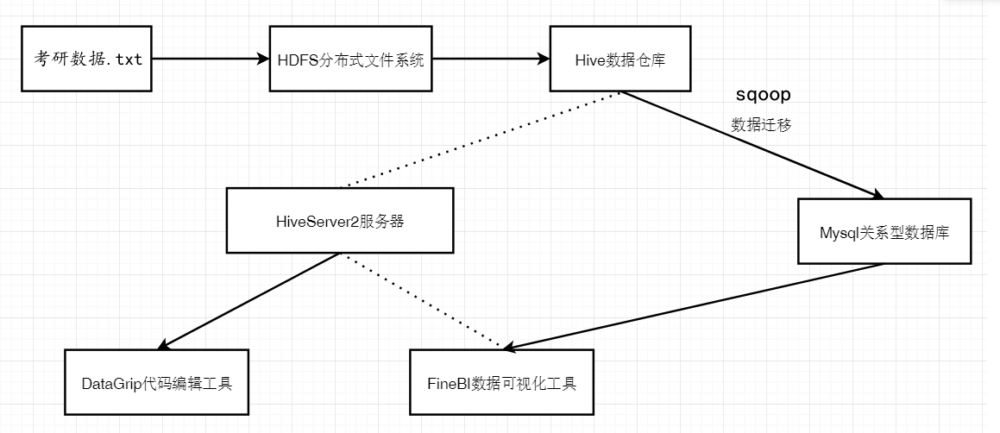

###  5.2 Sqoop工具简介

>Sqoop是一款开源的工具，主要用于在Hadoop(Hive)与传统的数据库(mysql、postgresql...)间进行数据的传递，可以将一个关系型数据库（例如 ： MySQL ,Oracle ,Postgres等）中的数据导进到Hadoop的HDFS中，也可以将HDFS的数据导进到关系型数据库中。

#### ---Sqoop工具原理

>将导入或导出命令翻译成mapreduce程序来实现。

> 在翻译出的mapreduce中主要是对inputformat和outputformat进行定制

### 5.3 Sqoop数据导出语句

> 从大数据集群Hive传输到非大数据集群Mysql:导出export

#### 1) 相关命令行语句:

```shell
/opt/module/sqoop/bin/sqoop export \  

--connect jdbc:mysql://hadoop202:3306/result_data_class01 \

--username root \

--password 123456 \

--table dept_new \

--num-mappers 1 \

--export-dir /user/hive/warehouse/dept \

--input-fields-terminated-by "\t"
```

#### 2) 语句分析及注意事项:

> + 1.Mysql中数据表需要提前创建,字段个数要和导出的Hive数据表一致
> + 2.保证export_dir 导出目录中有数据
> + 3.保证数据字段分隔符指定正确
>   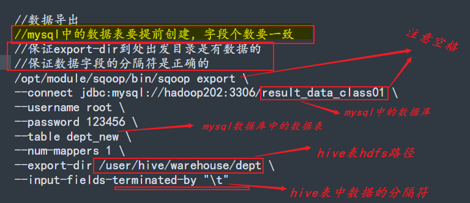

> * **命令行语句前提所需命令:**
>
>   > + 查看hive表数据存放在HDFS路径，和分隔符：
>   >
>   > ```mysql
>   >   show create table dept;
>   > ```
>   >
>   > 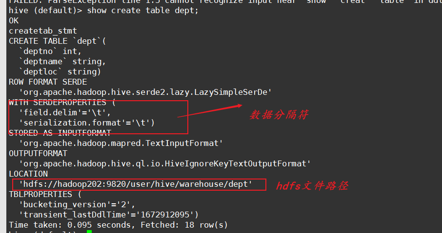
>
>   > + 查看表结构
>   >
>   > ```mysql
>   > desc 表名;
>   > ```
>   >
>   > 
>

### 5.4 Sqoop数据传输脚本的编写

##### 1. 需求描述&分析

> 利用shell命令,编写脚本,方便数据文件的传输,减少命令行的输入,提高文件传输操作效率.

##### 2.脚本R编写:

```shell
#! /bin/bash
case $1 in
"-s1"){
echo "=============从Linux本地装载数据到Hive表中[前提表存在]==================="
read -p '请输入Linux本地数据的绝对路径:' linuxPath
read -p '请输入Hive数据库：' database
read -p '请输入Hive表：' table
hive -e "load data local inpath '$linuxPath' overwrite into table $database.$table;"
};;

"-s2"){
echo "=============从HDFS装载数据到Hive表中[前提表存在]==================="
read -p '请输入HDFS数据的绝对路径:' hdfsPath
read -p '请输入Hive数据库：' database
read -p '请输入Hive表：' table
hive -e "load data  inpath '$hdfsPath' overwrite into table $database.$table;"
};;

"-s3"){
echo "=============启动Sqoop将数据从Mysql表中传输到Hive表中[hive自动建表]==================="
read -p '请输入源头的Mysql数据库:' mysql_databases
read -p '请输入源头Mysql数据表:' mysql_databases
read -p '请输入目的地的Hive库：' hive_databases
read -p '请输入目的地的Hive表：' hive_table

/opt/module/sqoop/bin/sqoop export \
--connect jdbc:mysql://hadoop202:3306/$mysql_databases \
--username root \
--password 123456 \
--table $mysql_table \
--num-mappers 1 \
--hive-import \
--fields-terminated-by "\t" \
--hive-overwrite \
--create-hive-table \
--hive-table $hive_databases.$hive_table
};;

"-s4"){
echo "=============启动Sqoop将数据hive表中数据传输到Mysql表中[Mysql表提前存在]==================="
echo " 数据导出export 注意:
		1 保证 Mysql表示提前创建的,字段个数一致
		2 保证 export-dir 导出目录是有数据的
		3 保证数据字段的分隔符是正确的,分隔符必须是'\t' "
read -p '请输入源头的hive数据库:' hive_databases
read -p '请输入源头hive数据表:' hive_table
read -p '请输入目的地的mysql库：' mysql_databases
read -p '请输入目的地的mysql表：' mysql_table

/opt/module/sqoop/bin/sqoop export \
--connect jdbc:mysql://hadoop202:3306/$mysql_databases \
--username root \
--password 123456 \
--table $mysql_table \
--num-mappers 1 \
--export-dir /user/hive/warehouse/$hive_databases.db/$hive_table \
--input-fields-terminated-by "\t"

};;

*)
echo "命令输入错误，正确命令：
-s1		从linux本地装载数据到hive表中[前提表存在]

-s2		从hdfs装载数据到hive表中[前提表存在]

-s3		启动Sqoop将数据从Mysql表中传输到Hive表中[hive自动建表]

-s4		启动Sqoop将数据hive表中数据传输到Mysql表中[Mysql表提前存在]
"
exit;
;;
esac

echo "Execution Done!!!"
```

### 5.5 将Hive中的数据表导出至Mysql数据库中

#### 1). 需求分析

> + 利用编写的R脚本,在Linux本地将Hive数据仓库中的数据表导出至Mysql数据库中,便于后续FineBI可视化工具的稳定连接
>
> + 需求前提:
>
>   > 1. 保证 Mysql表示提前创建的,字段个数一致
>   > 2. 保证 export-dir 导出目录是有数据的
>   >   3. 保证数据字段的分隔符是正确的,分隔符必须是'\t' 

#### 2). 需求实现

> 1. 在DataGrip中查看Hive数据表的建表结构语句
> 2. 利用DataGrip,在Mysql数据库中建立与Hive数据库中对应的数据表
> 3. 利用R脚本,将Hive数据库中数据表数据导出至Mysql数据库中对应的数据表中
##### 1. 在DataGrip中查看Hive数据表的建表结构语句

> 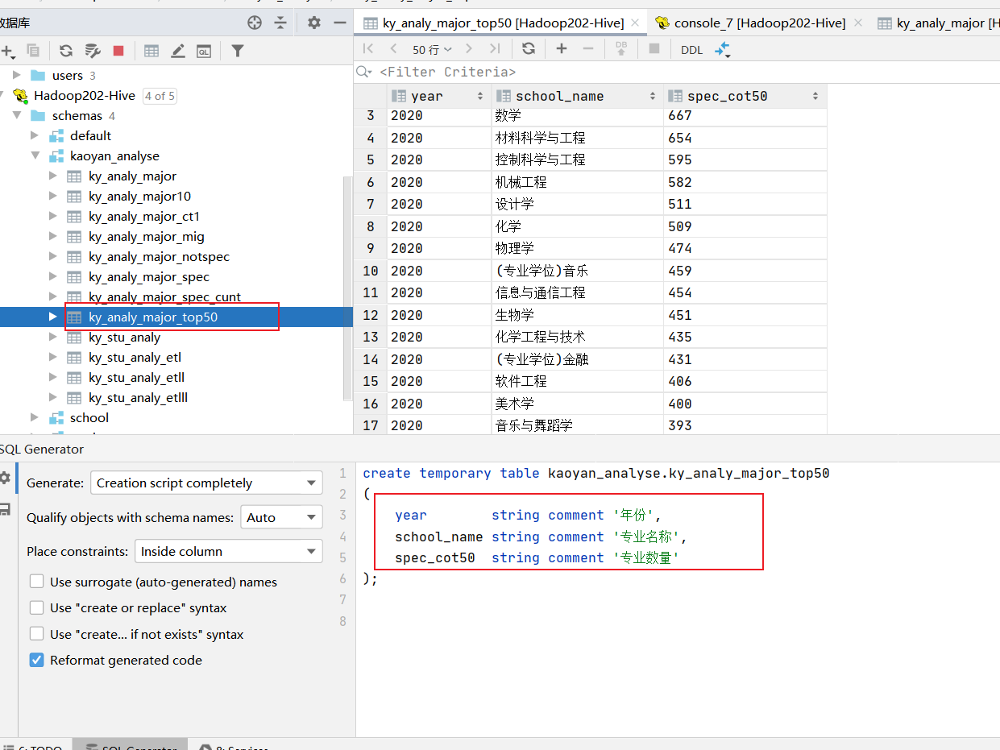


##### 2. 利用DataGrip,在Mysql数据库中建立与Hive数据库中对应的数据表

> Mysql数据表字段名要与Hive中的表数据对应
> 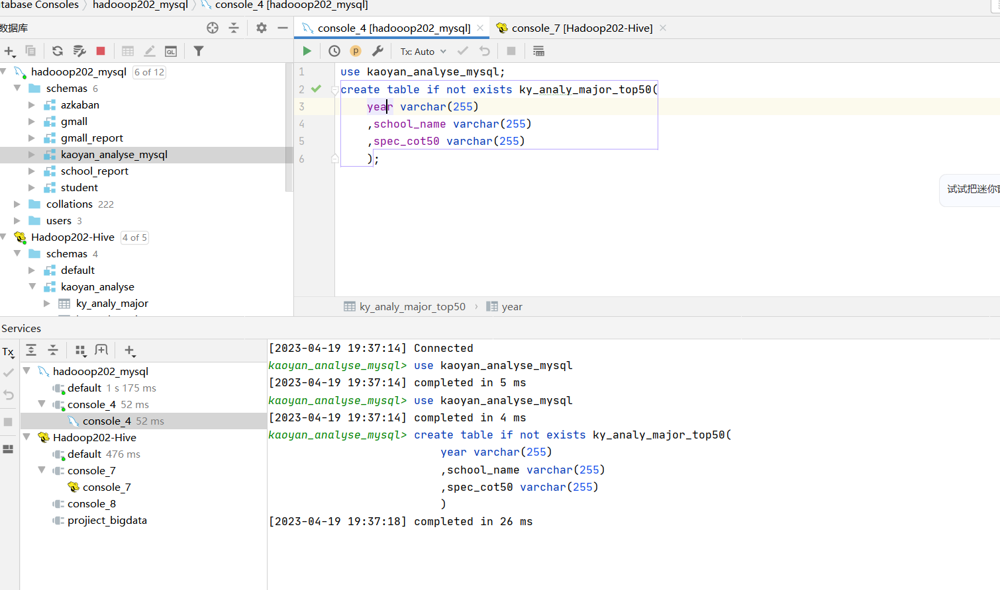

##### 3. 利用R脚本,将Hive数据库中数据表数据导出至Mysql数据库中对应的数据表中

> 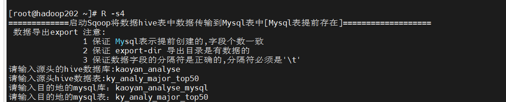
> + 通过DataGrip查询Mysql数据表中数据
>
>   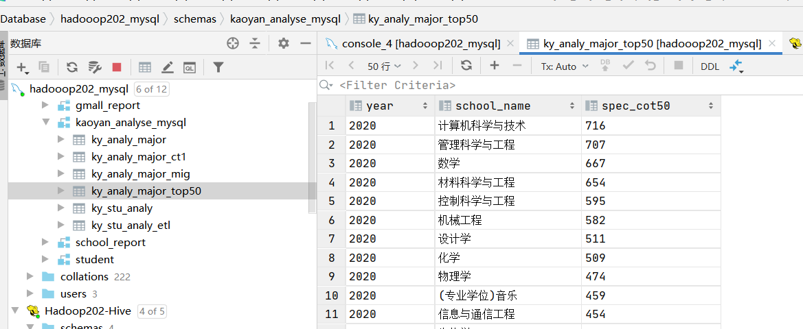
>

---

## 六.数据可视化FineBI
### 6.1. FineBI的界面
> + 目录：首页大屏及帮助文档
>
>   
>
> +  仪表盘：用于构建所有可视化报表
>
>   
>
> + 数据准备：用于配置各种报表的数据来源
>
>   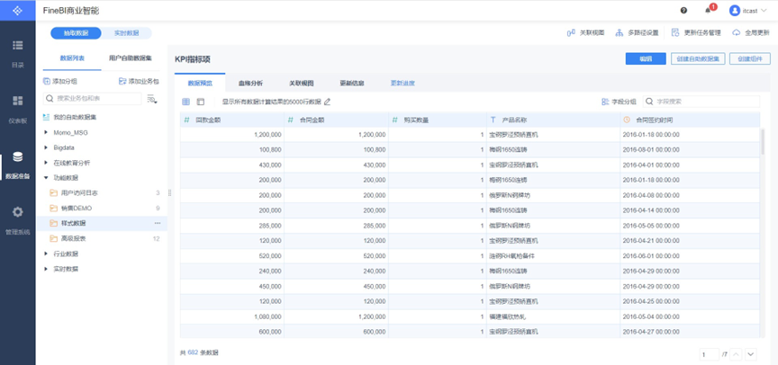
>
> +  管理系统：用于管理整个FineBI的使用：用户管理、数据源管理、插件管理、权限管理等
>
>   
### 6.2 FineBI配置数据源及数据准备

#### 6.2.1 构建连接

> + 新建连接
>
>   
>
>   
>
> + 配置连接
>
>   
>
> + 测试连接
>
>   
>
> + 保持连接
>
>   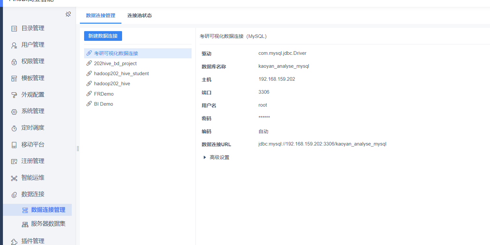

#### 6.2.2 数据准备

> + 新建分组
>
>   
>
> + 添加业务包
>
>   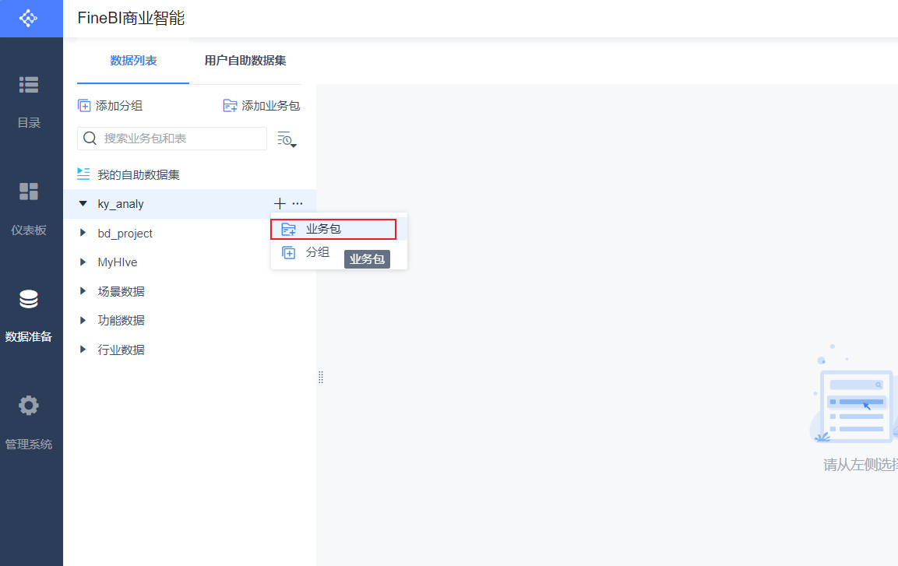
>
> + 添加表
>
>   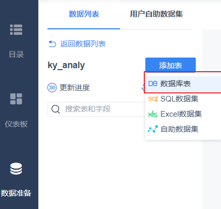
>
>   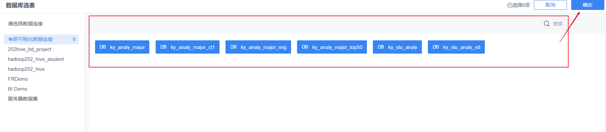
>
> + 更新业务包
>
>   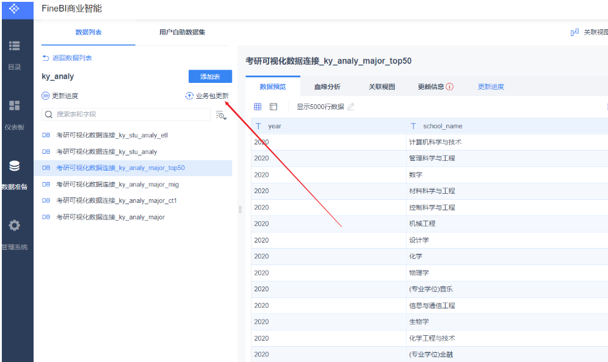

### 6.3 FineBI 构建可视化报表

#### 6.3.1看板展示: 考研学校专业总数

> 

#### 6.3.2 看板展示：考研学校专业数据一览表

> 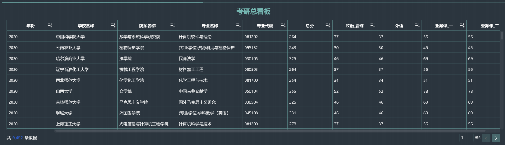

#### 6.3.3 看板展示: 考研专业数量树图

> 

#### 6.3.4 看板展示:考研相关数据词云图展示

> 
#### 6.3.5 看板展示: 专业学位学校top10地图看板

> 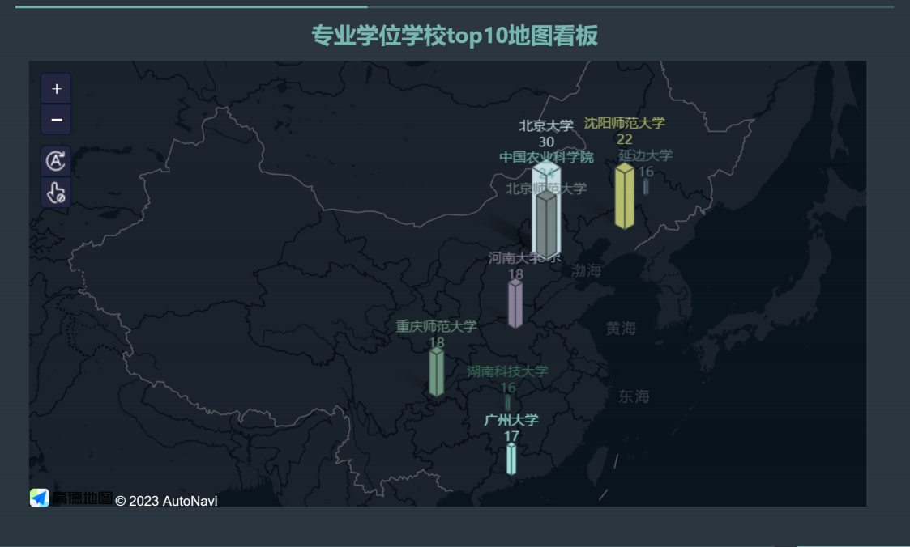
#### 6.3.6看板展示: 专业top50饼图

> 

#### 6.3.7 看板展示: 考研学校相关分数展示-表格图

> 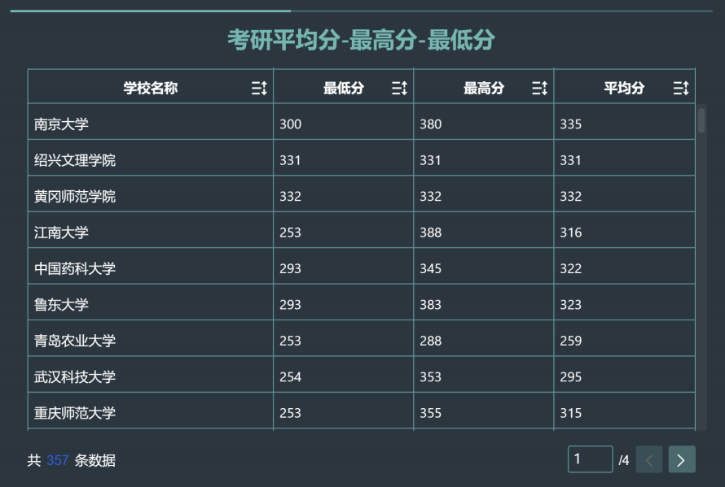
#### 6.3.8 看板展示: 考研学校最低-最高分 桑基图

> 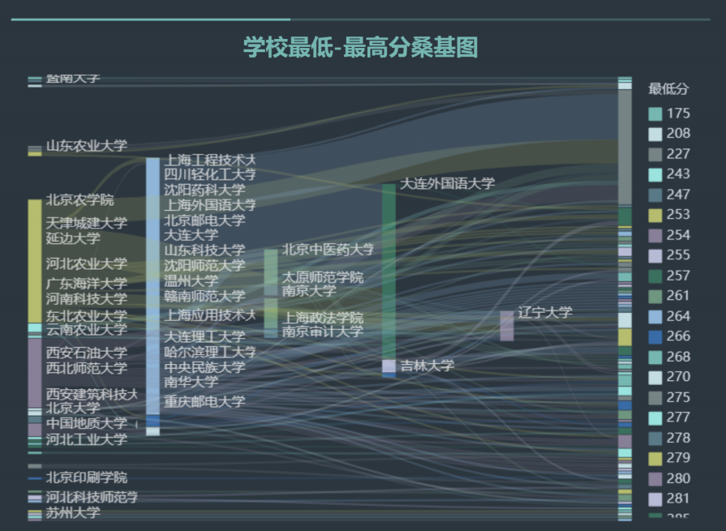

---

## 七.开发总结

#### 1. Hive分隔符问题解决方法:__建立新表__
>
>   ```mysql
>   ---创建hive表
>   create table student.tb_msg_res_new(
>   msg_year             string  comment "日期"
>   , msg_hour        string  comment "小时"
>   , sender_add1     string  comment "发送人纬度"
>   , sender_add2         string  comment "发送人经度"
>   )
>   --指定分隔符为制表符
>   row format delimited fields terminated by '\t'; --指定数据分隔符为tab
>
>   --加载数据
>   --将查询的结果插入这张表
>   insert overwrite table class01.tb_msg_res_new
>   select
>   msg_year,
>   msg_hour,
>   sender_add1,
>   sender_add2
>   from tb_msg_res limit 10;
>   ```

